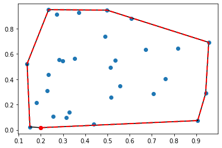
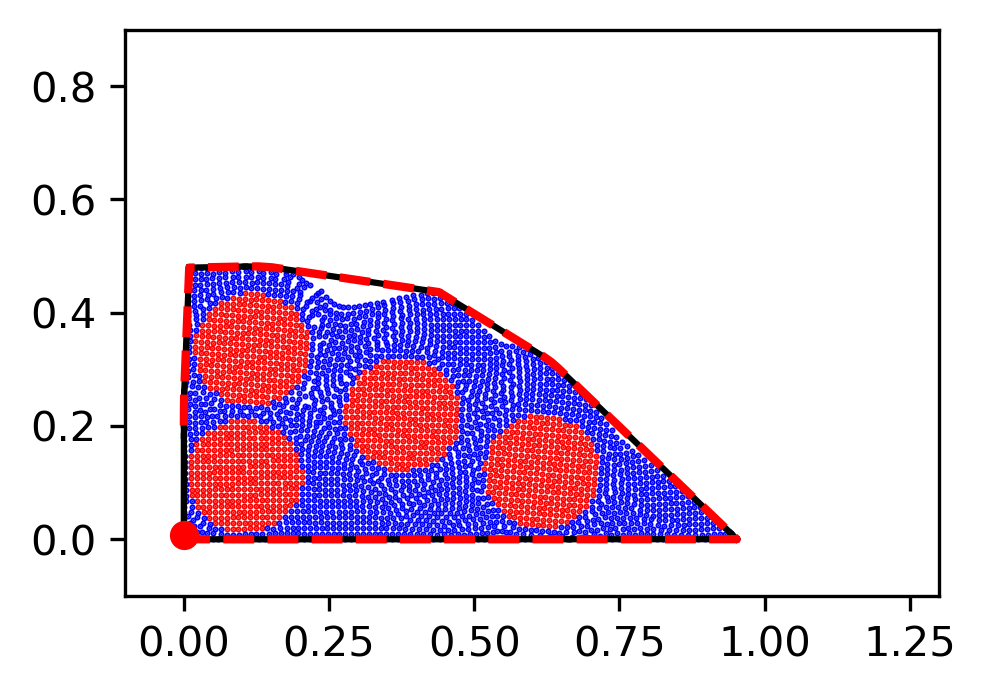
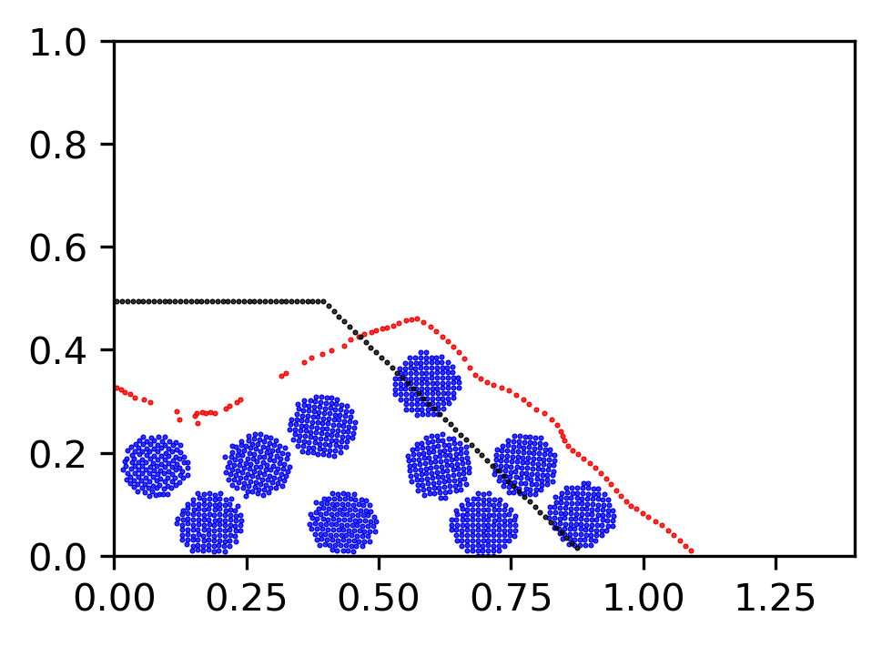
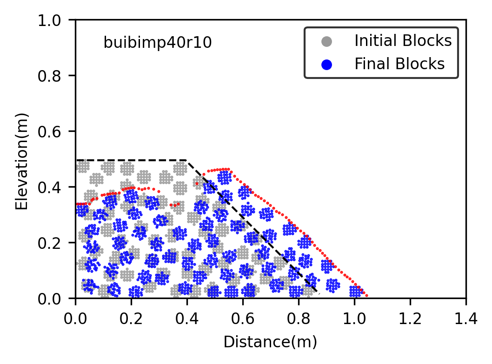
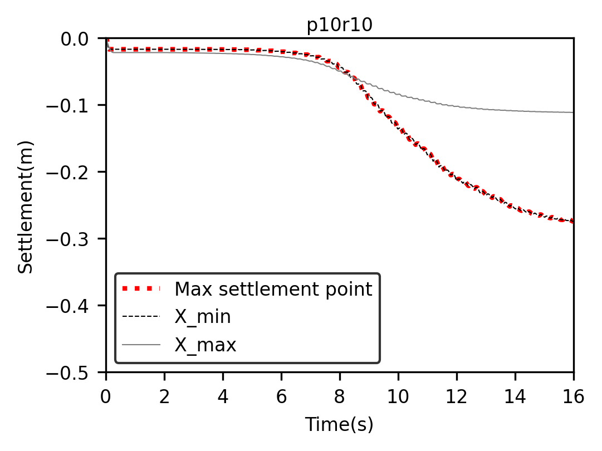
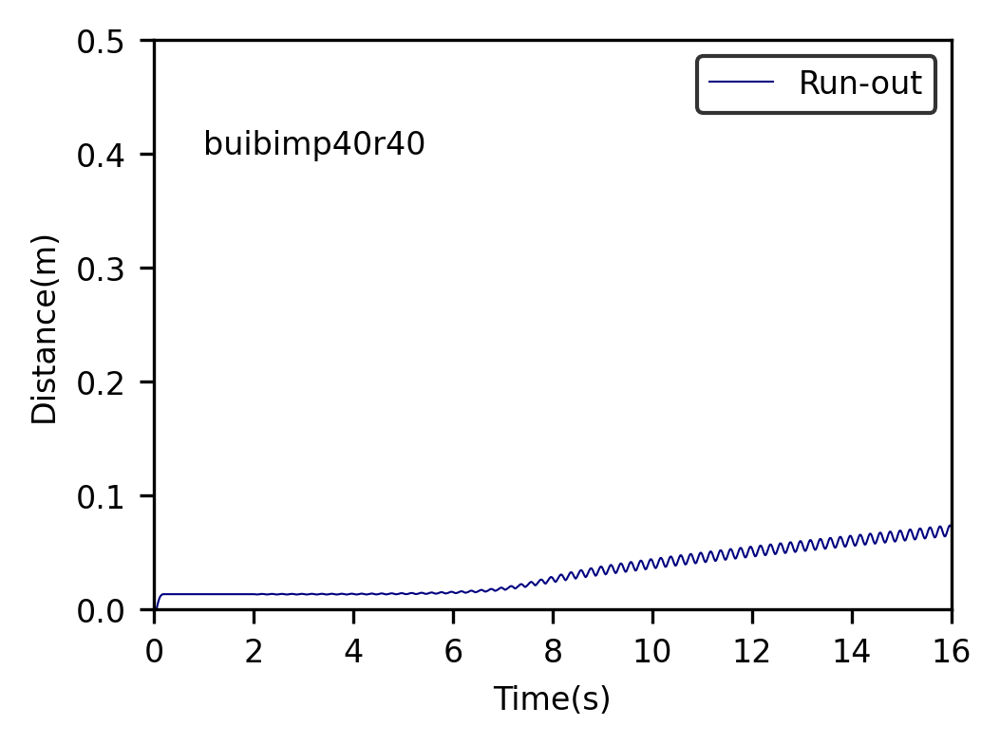

# BIM SLOPE SUBJECT TO SHAKING

## 1. Plotting deformation result

A figure to describle the final shape of Bimslope is necessary for the seismic behavior research.  
Details of blocks should be included in this figure. Cells below showed Zheng's attempt for this  
issue.

### 1.1 Edge detection sample


```python
import numpy as np
from scipy.spatial import ConvexHull, convex_hull_plot_2d
points = np.random.rand(30, 2)   # 30 random points in 2-D
hull = ConvexHull(points)

import matplotlib.pyplot as plt
plt.plot(points[:,0], points[:,1], 'o')
for simplex in hull.simplices:
    plt.plot(points[simplex, 0], points[simplex, 1], 'k-')

plt.plot(points[hull.vertices,0], points[hull.vertices,1], 'r--', lw=2)
plt.plot(points[hull.vertices[0],0], points[hull.vertices[0],1], 'ro')
plt.show()
```


    

    


### 1.2 Slope shape edge detection
#### Step 1


```python
import matplotlib.ticker as ticker
import matplotlib.tri as tri
import matplotlib.pyplot as plt
import numpy as np
import h5py
import os
import shutil
import matplotlib as mpl
from scipy.spatial import ConvexHull, convex_hull_plot_2d
fin = h5py.File('/home/zheng/Msys_result/0704/buibimp40r10_0800.h5',mode = 'r')
SLSP = np.array(fin.get('Position'))
dsp = len(SLSP)
rowsp = int(dsp/3)
print(dsp,rowsp)
SLSP = np.array(SLSP).reshape(rowsp,3)
X = SLSP[:, 0]
X = X.flatten()
Y = SLSP[:, 1]
Y = Y.flatten()
points = np.ones((rowsp,2))
points[:,0]=points[:,0]*X
points[:,1]=points[:,1]*Y

plt.figure(figsize=(3.5, 2.5), dpi=300)         
print(points)
hull = ConvexHull(points)
plt.scatter(points[:,0], points[:,1], s = 0.2)
for simplex in hull.simplices:
    plt.plot(points[simplex, 0], points[simplex, 1], 'k-')
plt.axis([-0.1,1.3,-0.1,0.9])
plt.plot(points[hull.vertices,0], points[hull.vertices,1], 'r--', lw=2)
plt.plot(points[hull.vertices[0],0], points[hull.vertices[0],1], 'ro')
plt.plot(constrained_layout=True)
plt.show()

```

    9675 3225
    [[ 5.34509309e-03 -2.66557581e-05]
     [ 1.97995361e-02 -3.51441013e-05]
     [ 6.98746964e-02 -3.46554116e-05]
     ...
     [ 5.29005945e-01  4.63117629e-01]
     [ 5.38251221e-01  4.63596165e-01]
     [ 5.48598468e-01  4.64095205e-01]]


    

    


#### Step 2


```python
import matplotlib.ticker as ticker
import matplotlib.tri as tri
import matplotlib.pyplot as plt
import numpy as np
import h5py
import os
import shutil
import matplotlib as mpl
from scipy.spatial import ConvexHull, convex_hull_plot_2d
finin = h5py.File('/home/zheng/Msys_result/0704/buibimp40r40_Initial.h5',mode = 'r')
fin = h5py.File('/home/zheng/Msys_result/0704/buibimp40r40_0800.h5',mode = 'r')
SLTG = np.array(fin.get('Tag'))
SLSP = np.array(fin.get('Position'))
DP = np.array(fin.get('DEMPosition'))
DPini = np.array(finin.get('DEMPosition'))
# the initial position of DEM
dx = DP[0]-DPini[0]
dy = DP[1]-DPini[1]
dsp = len(SLSP)
rowsp = int(dsp/3)
SLSP = np.array(SLSP).reshape(rowsp,3)
X = SLSP[:, 0]+dx
X = X.flatten()+dy
Y = SLSP[:, 1]
Y = Y.flatten()
points = np.ones((rowsp,3))
points[:,0]=points[:,0]*X
points[:,1]=points[:,1]*Y
points[:,2]=points[:,2]*SLTG[:].T

Blockpoint = []
Matrixpoint = []
for ii in range(rowsp):
    if points[ii,2]==5:
        Blockpoint.append(points[ii,:])
    else:
        Matrixpoint.append(points[ii,:])    

Blockpoint = np.array(Blockpoint)
Matrixpoint = np.array(Matrixpoint)
XB = Blockpoint[:,0]
YB = Blockpoint[:,1]
XM = Matrixpoint[:,0]
YM = Matrixpoint[:,1]

plt.figure(figsize=(3.5, 2.5), dpi=300)
plt.scatter(XB, YB, c = "r", s = 0.2)
plt.scatter(XM, YM, c = "b", s = 0.2)
Point = np.ones((rowsp,2))
Point[:,0]=Point[:,0]*X
Point[:,1]=Point[:,1]*Y
hull = ConvexHull(Point)
for simplex in hull.simplices:
    plt.plot(Point[simplex, 0], Point[simplex, 1], 'k-')
plt.axis([-0.1,1.3,-0.1,0.9])
plt.plot(Point[hull.vertices,0], Point[hull.vertices,1], 'r--', lw=2)
plt.plot(Point[hull.vertices[0],0], Point[hull.vertices[0],1], 'ro')
plt.plot(constrained_layout=True)
plt.show()

```


    

    


#### Step 3


```python
import matplotlib.ticker as ticker
import matplotlib.tri as tri
import matplotlib.pyplot as plt
import numpy as np
import h5py
import os
import shutil
import matplotlib as mpl
from scipy.spatial import ConvexHull, convex_hull_plot_2d
finin = h5py.File('/home/zheng/Msys_result/0704/buibimp40r25_Initial.h5',mode = 'r')
fin = h5py.File('/home/zheng/Msys_result/0704/buibimp40r25_0800.h5',mode = 'r')
SLTG = np.array(fin.get('Tag'))
SLSP = np.array(fin.get('Position'))
DP = np.array(fin.get('DEMPosition'))
DPini = np.array(finin.get('DEMPosition'))

dx = DP[0]-DPini[0]
dy = DP[1]-DPini[1]
dsp = len(SLSP)
rowsp = int(dsp/3)
SLSP = np.array(SLSP).reshape(rowsp,3)
X = SLSP[:, 0]+dx
X = X.flatten()+dy
Y = SLSP[:, 1]
Y = Y.flatten()
points = np.ones((rowsp,3))
points[:,0]=points[:,0]*X
points[:,1]=points[:,1]*Y
points[:,2]=points[:,2]*SLTG[:].T

Blockpoint = []
Matrixpoint = []
for ii in range(rowsp):
    if points[ii,2]==5:
        Blockpoint.append(points[ii,:])
    else:
        Matrixpoint.append(points[ii,:])    

Blockpoint = np.array(Blockpoint)
Matrixpoint = np.array(Matrixpoint)
XB = Blockpoint[:,0]
YB = Blockpoint[:,1]
XM = Matrixpoint[:,0]
YM = Matrixpoint[:,1]

plt.figure(figsize=(3.5, 2.5), dpi=300)
plt.scatter(XB, YB, c = "b", s = 0.2)
# plt.scatter(XM, YM, c = "b", s = 0.2)
Point = np.ones((rowsp,2))
Point[:,0]=Point[:,0]*X
Point[:,1]=Point[:,1]*Y
# hull = ConvexHull(Point)
# for simplex in hull.simplices:
#     plt.plot(Point[simplex, 0], Point[simplex, 1], 'k-')
plt.axis([0,1.4,0,1.0])
# plt.plot(Point[hull.vertices,0], Point[hull.vertices,1], 'r--', lw=2)
# plt.plot(Point[hull.vertices[0],0], Point[hull.vertices[0],1], 'ro')

SPini = np.array(finin.get('Position'))
SPini = np.array(SPini).reshape(rowsp,3)

for ii in range(rowsp):
    xii = SPini[ii,0]
    yii = SPini[ii,1]
    for jj in range(rowsp):
        xjj = SPini[jj,0]
        if xjj == xii:
            yjj = SPini[jj,1]
            if yjj > yii:
                SPini[jj,2]=10
                SPini[ii,2]=0

SLSP[:,2]=SLSP[:,2]+SPini[:,2]
Bound = []
Boundini = []  
for ii in range(rowsp):
    if SLSP[ii,2]==10:
        Bound.append(SLSP[ii,:])
        Boundini.append(SPini[ii,:])

Bound = np.array(Bound)
Boundini = np.array(Boundini)
plt.scatter(Bound[:,0],Bound[:,1], c='r', s=0.2)     
plt.scatter(Boundini[:,0],Boundini[:,1], c='k', s=0.2) 
plt.plot(constrained_layout=True)
plt.show()
```


    

    


#### Step 4


```python
import matplotlib.ticker as ticker
import matplotlib.tri as tri
import matplotlib.pyplot as plt
import numpy as np
import h5py
import os
import shutil
import matplotlib as mpl
from scipy.spatial import ConvexHull, convex_hull_plot_2d
resultname = 'buibimp40r10'
resultdir = '/home/zheng/Msys_result/0704/'
picdir = '/home/zheng/Msys_result/0704fig/'
finin = h5py.File(resultdir + resultname + '_Initial.h5',mode = 'r')
fin = h5py.File(resultdir + resultname + '_0800.h5',mode = 'r')
SLTG = np.array(fin.get('Tag'))
SLSP = np.array(fin.get('Position'))
DP = np.array(fin.get('DEMPosition'))
DPini = np.array(finin.get('DEMPosition'))
SLTGini = np.array(finin.get('Tag'))
SLSPini = np.array(finin.get('Position'))

dx = DP[0]-DPini[0]
dy = DP[1]-DPini[1]
dsp = len(SLSP)
rowsp = int(dsp/3)

########################## Initial block plotting ############################
SLSPini = np.array(SLSPini).reshape(rowsp,3)
inis = np.ones((rowsp,3))
inis[:,0] = inis[:,0]*SLSPini[:,0]
inis[:,1] = inis[:,1]*SLSPini[:,1]
inis[:,2] = inis[:,2]*SLTGini[:].T
Blockini = []
Matrixini = []
for ii in range(rowsp):
    if inis[ii,2]==5:
        Blockini.append(inis[ii,:])
        # block particles were tagged '5' in model code
    else:
        Matrixini.append(inis[ii,:]) 
        
Blockini = np.array(Blockini)
Matrixini = np.array(Matrixini)

plt.figure(figsize=(3.5, 2.5), dpi=300)
plt.axis([0.0,1.4,0.0,1])
plt.xticks(np.linspace(0,1.4,8), fontsize = 8)
plt.yticks(np.linspace(0,1.0,6), fontsize = 8)
plt.xlabel('Distance(m)', fontsize = 8)
plt.ylabel('Elevation(m)', fontsize = 8)
#plt.title(resultname, fontsize = 8, loc = 'center', y = 0.98)
plt.text(0.1, 0.9, str(resultname), fontsize = 8)
# add text on plotting layer
plt.scatter(Blockini[:, 0], Blockini[:, 1], c = "0.6", s = 0.2, 
            label = 'Initial Blocks')
# plt.scatter(Matrixini[:, 0], Matrixini[:, 0], c = "b", s = 0.2)
########################## Initial block plotting ############################


########################## Final block plotting ##############################
SLSP = np.array(SLSP).reshape(rowsp,3)
DXY = np.ones((rowsp,2))
X = SLSP[:, 0]-dx*DXY[:,0]
X = X.flatten()
Y = SLSP[:, 1]-dy*DXY[:,1]
Y = Y.flatten()
points = np.ones((rowsp,3))
points[:,0]=points[:,0]*X
points[:,1]=points[:,1]*Y
points[:,2]=points[:,2]*SLTG[:].T

Blockpoint = []
Matrixpoint = []
for ii in range(rowsp):
    if points[ii,2]==5:
        Blockpoint.append(points[ii,:])
    else:
        Matrixpoint.append(points[ii,:])    

Blockpoint = np.array(Blockpoint)
Matrixpoint = np.array(Matrixpoint)
XB = Blockpoint[:,0]
YB = Blockpoint[:,1]
XM = Matrixpoint[:,0]
YM = Matrixpoint[:,1]

plt.scatter(XB, YB, c = "b", s = 0.2, label = 'Final Blocks')
# plt.scatter(XM, YM, c = "b", s = 0.2)
########################## Final block plotting ##############################

###################### Profile tracing (not neccessary) ######################
# Point = np.ones((rowsp,2))
# Point[:,0]=Point[:,0]*X
# Point[:,1]=Point[:,1]*Y
# hull = ConvexHull(Point)
# for simplex in hull.simplices:
#     plt.plot(Point[simplex, 0], Point[simplex, 1], 'k-')
# plt.plot(Point[hull.vertices,0], Point[hull.vertices,1], 'r--', lw=2)
# plt.plot(Point[hull.vertices[0],0], Point[hull.vertices[0],1], 'ro')
###################### Profile tracing (not neccessary) ######################

############################# boundary plotting ##############################
SPini = np.array(finin.get('Position'))
SPini = np.array(SPini).reshape(rowsp,3)

for ii in range(rowsp):
    xii = SPini[ii,0]
    yii = SPini[ii,1]
    for jj in range(rowsp):
        xjj = SPini[jj,0]
        if xjj == xii:
            yjj = SPini[jj,1]
            if yjj > yii:
                SPini[jj,2]=10
                SPini[ii,2]=0

SLSP[:,2]=SLSP[:,2]+SPini[:,2]

Bound = []
Boundini = []  
for ii in range(rowsp):
    if SLSP[ii,2]==10:
        Bound.append(SLSP[ii,:])
        Boundini.append(SPini[ii,:])

Bound = np.array(Bound)
Boundini = np.array(Boundini)
Boundini = Boundini[Boundini[:,0].argsort()]

plt.scatter(Bound[:,0],Bound[:,1], c='r', s=0.2)     
# plt.scatter(Boundini[:,0],Boundini[:,1], c='k', s=0.2)   
plt.plot(Boundini[:,0],Boundini[:,1], 'k--', lw=1) 
############################# boundary plotting ##############################

plt.plot(constrained_layout=True)
plt.legend(loc = 'upper right', edgecolor = 'black', markerscale = 10, 
           fontsize = 8)
plt.subplots_adjust(top = 0.95, bottom = 0.15, left = 0.15, right = 0.95)
plt.savefig(picdir + resultname + '.png')  
plt.show()
plt.clf()
plt.cla()
plt.close()
```


    

    


## 2 Basic result treatment
### 2.1 Result files operation


```python
import matplotlib.ticker as ticker
import matplotlib.tri as tri
import matplotlib.pyplot as plt
import numpy as np
import h5py
import os
import shutil
import matplotlib as mpl

resultname = 'buibimp40r10'
maindir = '/home/zheng/Msys_result/'
resultdir = '0704/'
projectname ='settlement/'
# make a new directory for project
os.mkdir(maindir+resultname)
os.chdir(maindir+resultdir+'/')
# change working directory to where contains original result files

filePath = maindir+resultdir
for i in os.listdir(filePath):
    if i.startswith(resultname):
        if i.endswith('.h5'):
            #synpo = i.index('_')
            #ii = i[synpo + 1]
            #if ii.isnumeric() is True:
                shutil.copy2(i, maindir+resultname+'/')
# Copy corresponding h5 files to new folder
```

### 2.2 Settlements on slope crest


```python
import matplotlib.ticker as ticker
import matplotlib.tri as tri
import matplotlib.pyplot as plt
import numpy as np
import h5py
import os
import sys
import shutil
import matplotlib as mpl
# Check the nametype of results before running this file. As h5/npy files named
# as 'XXXX', we should add '0' or '00' in the string.
totaltime = 16.00
resultname = 'buibimp10r10'
maindir = '/home/zheng/Msys_result/'
resultdir = '0704/'
projectname ='settlement/'
os.mkdir(maindir+resultname+'/'+projectname)
# make a new directory for project
os.chdir(maindir+resultname+'/')
# change the working path

###################### Initial information collectting #######################
fin = h5py.File(maindir + resultname + '/' 
                + resultname + '_' + 'Initial.h5', mode = 'r')
iniSPHposition = fin.get('Position')
dsp = len(iniSPHposition)
rowsp = int(dsp/3)
SLSPini = np.array(iniSPHposition)
SLSPini = np.array(SLSPini).reshape(rowsp,3)
    # SLSPini: initial position of SPH particles
SLTGini = np.array(fin.get('Tag'))
    # SLTGini: tag of SPH particles
DPini = np.array(fin.get('DEMPosition'))
    # DPini: initial position of DEMparticles
Marksetini = np.zeros((rowsp,4))
Marksetini[:,0] = SLSPini[:,0]
Marksetini[:,1] = SLSPini[:,1]
Marksetini[:,2] = SLTGini[:].T
    # Creat a new set to input SPH data
cresty = np.max(SLSPini[:,1])
    # the height of model slopes
CREST = []
    # creat a empty set to save particles on crest
for i in range(rowsp):
    if SLSPini[i,1] == cresty:
        Marksetini[i,3] = 3
        CREST.append(Marksetini[i,:])
        # mark crest position particles in Markset

CREST = np.array(CREST)
np.save(maindir + resultname + '/' + projectname + 'CREST_ini.npy', CREST)
# np.savetxt(maindir+resultname+'/'+projectname+'Marksetini.npy', CREST)
###################### Initial information collectting #######################

################### Initial boundary information collecting ##################
for kk in range(rowsp):
    xkk = SLSPini[kk,0]
    ykk = SLSPini[kk,1]
    for pp in range(rowsp):
        xpp = SLSPini[pp,0]
        if xpp == xkk:
            ypp = SLSPini[pp,1]
            if ypp > ykk:
                SLSPini[pp,2] = 10
                SLSPini[kk,2] = 0

Boundini = []
for ii in range(rowsp):
    if SLSPini[ii,2] == 10:
        Boundini.append(SLSPini[ii,:])

Boundini = np.array(Boundini)
Boundini = Boundini[Boundini[:,0].argsort()]
# Boundini: initial slope shape 

################### Initial boundary information collecting ##################

########################## Crest particle collecting #########################

tnmx = 0
for i in os.listdir(maindir+resultname+'/'):
    if i.startswith(resultname):
        if i.endswith('.h5'):
            synpo = i.index('_')
            ii = i[synpo + 1]
            if ii.isnumeric() is True:
                f = h5py.File(i, mode = 'r')
                SLSP = np.array(f.get('Position')).reshape(rowsp,3)
                SLTG = np.array(f.get('Tag'))
                DP = np.array(f.get('DEMPosition'))
                dx = DP[0]-DPini[0]
                dy = DP[1]-DPini[1]
                DXY = np.ones((rowsp,2))
                Markset = np.zeros((rowsp,4))
                Markset[:,0] = SLSP[:,0]-dx*DXY[:,0]
                Markset[:,1] = SLSP[:,1]-dy*DXY[:,1]
                Markset[:,2] = SLTG.T
                Markset[:,3] = Marksetini[:,3]
                nfname = i.rstrip('h5')
                nfname = nfname.rstrip('.')
                nfname = nfname.lstrip(resultname)
                num = int(nfname.lstrip('_'))
                if num >= tnmx:
                    tnmx = num
                    # Check which file is the last one
                CREST = []
                for j in range(rowsp):
                    if Markset[j,3] == 3:
                        CREST.append(Markset[j,:])
                
                CREST = np.array(CREST)
                np.save(maindir + resultname + '/' + projectname + 'CREST' 
                           + nfname +'.npy', CREST)
########################## Crest particle collecting #########################

########################## Data picking and reshape ##########################
os.chdir(maindir+resultname+'/'+projectname)
# ********* do not delete order code above
# Changing working directory is mantodary, or it won't run left lines
Cini = np.load(maindir + resultname + '/' + projectname 
               + 'CREST_ini.npy', allow_pickle=True)
# 'allow_pickle=True' is necessary
if tnmx < 1000:
    if tnmx < 100:
        tnmx = '00' + str(tnmx)
    else:
        tnmx = '0' + str(tnmx)
        
Cfinal = np.load(maindir + resultname + '/' + projectname 
                 + 'CREST_' + tnmx + '.npy', allow_pickle=True)
SF = Cini[:, 1] - Cfinal[:, 1]
# Obtain the final settlement of each particles on crest
smx = np.max(SF)
smxp = np.where(SF == smx)
smxp = int(smxp[0])
bcrsmxp = Cini[smxp, :]
# Max settlement position on crest

crxmin = np.min(Cini[:,0])
crxminp = np.where(Cini[:,0] == crxmin)
crxminp = int(crxminp[0])
# xmin on crest
crxmax = np.max(Cini[:,0])
crxmaxp = np.where(Cini[:,0] == crxmax)
crxmaxp = int(crxmaxp[0])
# xmax on crest
# Mark where is the max settlement for crest

tnmx = int(tnmx)
stfin = np.zeros((tnmx + 1,7)) 
stfin[0,1] = Cini[smxp, 0]             
stfin[0,2] = Cini[smxp, 1] 
stfin[0,3] = Cini[crxminp, 0]
stfin[0,4] = Cini[crxminp, 1]
stfin[0,5] = Cini[crxmaxp, 0]
stfin[0,6] = Cini[crxmaxp, 1]

rstfin = np.zeros((tnmx + 1,4)) 
 
for i in range(tnmx):
    idx = i + 1
    if idx < 1000:
        if idx < 10:
            idx = '000' + str(idx)
        elif idx < 100:
            idx = '00' + str(idx)
        else:
            idx = '0' + str(idx)
    
    CF = np.load(maindir + resultname + '/' + projectname 
                 + 'CREST_' + idx + '.npy', allow_pickle=True)
    idx = int(idx)
    stfin[idx,0] = totaltime * idx/tnmx
    stfin[idx,1] = CF[smxp, 0]             
    stfin[idx,2] = CF[smxp, 1] 
    stfin[idx,3] = CF[crxminp, 0]
    stfin[idx,4] = CF[crxminp, 1]
    stfin[idx,5] = CF[crxmaxp, 0]
    stfin[idx,6] = CF[crxmaxp, 1]

np.savetxt(maindir + resultname + '/' + projectname + resultname
        + 'xympositioncollect.txt', stfin)    
rstfin[:, 0] = stfin[:, 0]
rstfin[:, 1] = - (Cini[smxp, 1] - stfin[:, 2])
rstfin[:, 2] = - (Cini[crxminp, 1] - stfin[:, 4])
rstfin[:, 3] = - (Cini[crxmaxp, 1] - stfin[:, 6])
np.savetxt(maindir + resultname + '/' + projectname + resultname
        + 'settlementxym.txt', rstfin)
########################### Profile of slope plotting ########################
plt.figure(figsize=(3.5, 2.5), dpi=300)
plt.axis([0.0,1.4,0.0,1])
plt.xticks(np.linspace(0,1.4,8), fontsize = 8)
plt.yticks(np.linspace(0,1.0,6), fontsize = 8)
plt.xlabel('Distance(m)', fontsize = 8)
plt.ylabel('Elevation(m)', fontsize = 8)
plt.title(resultname.lstrip('buibim'), fontsize = 8, loc = 'center', y = 0.98)
## ax.annotate('annotate', xy=(2, 1), xytext=(3, 4),
##             arrowprops=dict(facecolor='black', shrink=0.05))
## Above code for drawing annotate here 'Xmin & Xmax', edit it 22/07/2021
plt.plot(Boundini[:,0], Boundini[:,1], 'k', lw=1)
# plt.scatter(Cini[crxminp,0], Cini[crxminp,1], c = 'b', s = 10, marker = 'X', 
#             label = 'X_min')
# plt.scatter(Cini[crxmaxp,0], Cini[crxmaxp,1], c = 'b', s = 10, marker = 'X', 
#             label = 'X_max')
plt.scatter(bcrsmxp[0], bcrsmxp[1], c = 'r', s = 40, marker = 'o',
            label = 'Max settlement point')
plt.plot(constrained_layout=True)
plt.legend(loc = 'upper right', edgecolor = 'black', markerscale = 1, 
           fontsize = 8)
plt.subplots_adjust(top = 0.95, bottom = 0.15, left = 0.15, right = 0.95)
plt.savefig(maindir + resultname + '/' + projectname + resultname 
            + 'Markeprofile' + '.png') 
plt.show()
plt.clf()
plt.cla()
# Clear layer
plt.close()
########################### Profile of slope plotting ########################

############################ Settlement Time history #########################
plt.figure(figsize=(3.5, 2.5), dpi=300)
plt.axis([0.0, 16, -0.5, 0.0])
plt.xticks(np.linspace(0, 16, 9), fontsize = 8)
plt.yticks(np.linspace(-0.5, 0, 6), fontsize = 8)
plt.xlabel('Time(s)', fontsize = 8)
plt.ylabel('Settlement(m)', fontsize = 8)
plt.title(resultname.lstrip('buibim'), fontsize = 8, loc = 'center', y = 0.98)
plt.plot(rstfin[:, 0], rstfin[:, 1], color = 'red', linestyle = ':', 
         lw = 2, label = 'Max settlement point')
plt.plot(rstfin[:, 0], rstfin[:, 2], color = 'black', linestyle = '--',
         lw = 0.5, label = 'X_min')
plt.plot(rstfin[:, 0], rstfin[:, 3], color = 'grey', linestyle = '-',
         lw = 0.5, label = 'X_max')
plt.plot(constrained_layout=True)
plt.legend(loc = 'lower left', edgecolor = 'black', markerscale = 2, 
           fontsize = 8)
plt.subplots_adjust(top = 0.95, bottom = 0.15, left = 0.15, right = 0.95)
plt.savefig(maindir + resultname + '/' + projectname + resultname 
            + 'Settlementxym' + '.png')
plt.show()
plt.clf()
plt.cla()
# Clear layer
plt.close()
############################ Settlement Time history #########################

################################# LVDT monitoring ############################
# os.chdir(maindir+resultname+'/') 
## monitoring x = 0.2 0.35 0.65 0.85 y = 0.025 0.225 0.425 
# to be continued
```


    

    


    

    


### 2.3 Run-out of slope toe


```python
import matplotlib.ticker as ticker
import matplotlib.tri as tri
import matplotlib.pyplot as plt
import numpy as np
import h5py
import os
import sys
import shutil
import matplotlib as mpl
# Check the nametype of results before running this file. As h5/npy files named
# as 'XXXX', we should add '0' or '00' in the string.
totaltime = 16.00
resultname = 'buibimp40r40'
maindir = '/home/zheng/Msys_result/'
resultdir = '0704/'
projectname ='runout/'
os.mkdir(maindir+resultname+'/'+projectname)
# make a new directory for project
os.chdir(maindir+resultname+'/')
# change the working path

###################### Initial information collectting #######################
fin = h5py.File(maindir + resultname + '/' 
                + resultname + '_' + 'Initial.h5', mode = 'r')
iniSPHposition = fin.get('Position')
dsp = len(iniSPHposition)
rowsp = int(dsp/3)
SLSPini = np.array(iniSPHposition)
SLSPini = np.array(SLSPini).reshape(rowsp,3)
    # SLSPini: initial position of SPH particles
SLTGini = np.array(fin.get('Tag'))
    # SLTGini: tag of SPH particles
DPini = np.array(fin.get('DEMPosition'))
    # DPini: initial position of DEMparticles
xm = np.max(SLSPini[:,0])
XM = np.where(SLSPini[:,0] == xm)
if len(XM) > 1:
    ym = 0.5
    for i in XM:
        yi = SLSPini[i,1]
        if yi<ym:
            ym = yi
            xmp = i

xmp = int(XM[0])
runxorini = np.array([0, SLSPini[xmp,0], SLSPini[xmp,1]])
# Find where is the slope toe
###################### Initial information collectting #######################

########################## Toe particle collecting ###########################

tnmx = 0
runxor = []
for i in os.listdir(maindir+resultname+'/'):
    if i.startswith(resultname):
        if i.endswith('.h5'):
            synpo = i.index('_')
            ii = i[synpo + 1]
            if ii.isnumeric() is True:
                f = h5py.File(i, mode = 'r')
                SLSP = np.array(f.get('Position')).reshape(rowsp,3)
                SLTG = np.array(f.get('Tag'))
                DP = np.array(f.get('DEMPosition'))
                dx = DP[0]-DPini[0]
                dy = DP[1]-DPini[1]
                nfname = i.rstrip('h5')
                nfname = nfname.rstrip('.')
                nfname = nfname.lstrip(resultname)
                num = int(nfname.lstrip('_'))
                if num >= tnmx:
                    tnmx = num
                    # Check which file is the last one
                toe = [num, SLSP[xmp,0] - dx, SLSP[xmp,1] - dy]
                runxor.append(toe)

runxor = np.array(runxor)
runxor = np.r_[runxor,[runxorini]]
runxor = runxor[runxor[:,0].argsort()]
runxor[:,0] = runxor[:,0]/tnmx*totaltime
runx = runxor
runx[:,1] = runx[:,1] - SLSPini[xmp,0]
np.savetxt(maindir + resultname + '/' + projectname 
           + resultname + 'runoutaxi.txt', runxor)
np.savetxt(maindir + resultname + '/' + projectname 
           + resultname + 'runout.txt', runx)

plt.figure(figsize=(3.5, 2.5), dpi=300)
plt.axis([0, 16, 0, 0.5])
plt.xticks(np.linspace(0, 16, 9), fontsize = 8)
plt.yticks(np.linspace(0, 0.5, 6), fontsize = 8)
plt.xlabel('Time(s)', fontsize = 8)
plt.ylabel('Distance(m)', fontsize = 8)
plt.text(1, 0.4, str(resultname), fontsize = 8)
plt.plot(runx[:,0], runx[:,1], color = 'navy', linestyle = '-', 
         lw = 0.5, label = 'Run-out')
plt.plot(constrained_layout=True)
plt.legend(loc = 'upper right', edgecolor = 'black', markerscale = 2, 
           fontsize = 8)
plt.subplots_adjust(top = 0.95, bottom = 0.15, left = 0.15, right = 0.95)
plt.savefig(maindir + resultname + '/' + projectname + resultname 
            + 'Runout' + '.png')
plt.show()
plt.clf()
plt.cla()
plt.close()               
```


    

    

